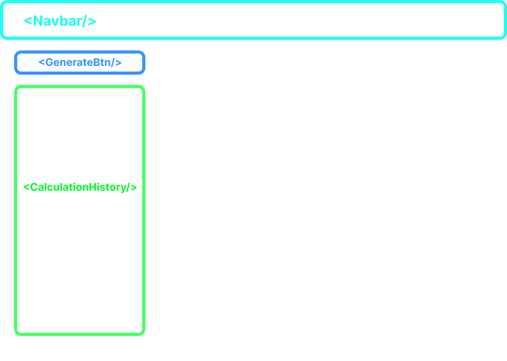

# RBI Calculator

## Links
- ### [Github](https://github.com/Vaasu-Dhand/rbi-calculator)
- ### [Code Sandbox](https://codesandbox.io/p/github/Vaasu-Dhand/rbi-calculator/master?layout=%257B%2522activeFilepath%2522%253A%2522%252Ftsconfig.json%2522%252C%2522openFiles%2522%253A%255B%2522%252FREADME.md%2522%252C%2522%252Ftsconfig.json%2522%255D%252C%2522sidebarPanel%2522%253A%2522EXPLORER%2522%252C%2522gitSidebarPanel%2522%253A%2522COMMIT%2522%252C%2522fullScreenDevtools%2522%253Afalse%252C%2522rootPanelGroup%2522%253A%257B%2522direction%2522%253A%2522vertical%2522%252C%2522type%2522%253A%2522PANEL_GROUP%2522%252C%2522id%2522%253A%2522DEVTOOLS_PANELS%2522%252C%2522panels%2522%253A%255B%257B%2522type%2522%253A%2522PANEL%2522%252C%2522panelType%2522%253A%2522TABS%2522%252C%2522id%2522%253A%2522clha6xhqk0009356nmy1i7kst%2522%257D%255D%252C%2522sizes%2522%253A%255B100%255D%257D%252C%2522tabbedPanels%2522%253A%257B%2522clha6xhqk0009356nmy1i7kst%2522%253A%257B%2522id%2522%253A%2522clha6xhqk0009356nmy1i7kst%2522%252C%2522activeTabId%2522%253A%2522clha6yec300d8356n3i81ocwj%2522%252C%2522tabs%2522%253A%255B%257B%2522type%2522%253A%2522TASK_LOG%2522%252C%2522taskId%2522%253A%2522dev%2522%252C%2522id%2522%253A%2522clha6xtpb006n356npg3hhft0%2522%257D%252C%257B%2522type%2522%253A%2522TASK_PORT%2522%252C%2522taskId%2522%253A%2522dev%2522%252C%2522port%2522%253A5173%252C%2522id%2522%253A%2522clha6xv1m00b6356ng93z2dxb%2522%252C%2522path%2522%253A%2522%252F%2522%257D%252C%257B%2522type%2522%253A%2522TERMINAL%2522%252C%2522id%2522%253A%2522clha6yec300d8356n3i81ocwj%2522%252C%2522shellId%2522%253A%2522clha6yegx001nfzjh9sehgx98%2522%257D%255D%257D%257D%252C%2522showSidebar%2522%253Atrue%252C%2522showDevtools%2522%253Atrue%252C%2522sidebarPanelSize%2522%253A15%252C%2522editorPanelSize%2522%253A48.12536613942589%252C%2522devtoolsPanelSize%2522%253A35%257D)

## Description
RBI Calculator is a simple calculator that can perform basic arithmetic operations such as addition, subtraction, multiplication, and division. It makes use of `cloud-evaluate`. The calculator provides the ability to reset the calculation. The output area will resize automatically based on the length of the calculation.


## Tests

<blockquote style="background-color: #FFCFCF; color: #FF0000;">
    <strong>Important:</strong> Qualified IDE was having issues running tests. I have provided a link to the github repository as well as a code sandbox that allows us to run the test script.

</blockquote>

### Running Tests:

- ### Code Sandbox:
  1. Go to the Code Sandbox link provived in the [Links](#links) section. 
  2. Click the plus icon near the top right corner.
  3. Select 'test' script.

- ### Locally
  1. Clone the github repo from the link provided in the [Links](#links) section.
  2. Run `npm i`
  3. Run `npm run test`

## Features
- Addition, subtraction, multiplication, and division operations are supported.
- Go back in time with history.
- Supports keyboard events.
- Clear functionality to clear the calculation (`Esc`).
- Handles error thrown by `cloud-evalaute` API by displaying 'Error' in the output.
- The display screen will resize based on the length of the calculation.
- Resonsive design to fit all screen sizes.

## Component Map
<table>
  <tr>
    <td class="col1">Calculator Screen</td>
    <td class="col2"></td>
  </tr>
  <tr>
    <td class="col1">History Screen</td>
    <td class="col2"></td>
  </tr>
</table>

<style>
  table {
    width: 100%;
    border-collapse: collapse;
  }
  
  td {
    padding: 10px;
    text-align: center;
  }
  
  .col1 {
    width: 10%;
  }
  
  .col2 {
    width: 50%;
  }
  
  img {
    width: 100%;
  }
</style>


## Application Design
The application has been designed with scalability and extendibility in mind. The folder structure is well-organized and can accommodate growth as the application expands. The state management system is built using React Context and provides a centralized location for managing the state of the application. 

## State Management
The applciation leverages React's Context API as a global state management solution. The `context` folder can be extended to store different contexts.

### Some important functions are described below:
- `combineComponents` - This is utility function that combines all the ContextProviders being used in the app to return a single ContextProvider (`AppContextProvider`). This is very similar to `combineReducers` from the redux world. 

This gives us two benefits:
  
  1. Reduces JSX.
  2. As we know, the order of Context Provider's matters. It eliminates this complexity as we're only wrapping our application with a single ContextProvider.

- `AppContext`: It is the global app context formed by combining all Contexts.
- `useStore`: Custom hook for accessing App context. 

Usage: 
```jsx
const {foo, bar} = useStore(state => state.contextName)
```

## Key Bindings
- `Esc` : Clear
- `+` : Add operator
- `-`: Subtract operator
- `*` : Multiply operator
- `/` : Divide operator
- `Enter`: Equals operator
- `.`: Decimal
- `0-9`: Digits
- `Backspace`: Delete

## Author
Vaasu Dhand